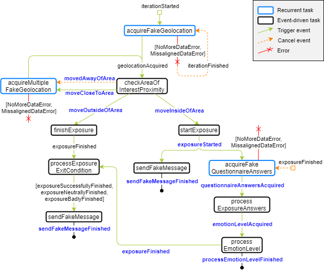

```{r setup, include=FALSE, eval=TRUE}
knitr::opts_chunk$set(echo = FALSE, warning=FALSE, message=FALSE)
```

Required libraries and source files with functions used are as follows:

```{r libraries_and_sources, echo=TRUE}
library(kableExtra)
library(here)
source("exp2/functions/00_json-utils.R")
source("exp2/functions/00_path-utils.R")
source("exp2/functions/01_captured-data-processing.R")
source("exp2/functions/02_key-events-extraction.R")
source("exp2/functions/03_key-events-evaluation.R")
```

# Introduction

As reported in the paper, we have developed a data capturing tool and a simulation tool using the NTD library. The data capturing tool includes a wide variety of tasks related to data gathering, analysis, decision making and reporting. Those tasks constitute a workflow based on a well-know treatment in mental health. The simulation tool is used to simulate sensor readings and user interactions from the data captured by the data capturing tool, allowing to stress the NTD library.

# Data capturing

The data capturing tool has been used once to collect real data for about 45 minutes with the BQAQUARISV device, simulating an exposure therapy described by the following task graph:



The data captured with this tool can be found in [`exp2/data-raw/captured-data.csv`](./exp2/data-raw/captured-data.csv). This files contains information about all the tasks that have been executed during the collecting process and events occurred. Each line of the file represents one executed task or event, including the following relevant information:

- `timestamp`: UNIX timestamp representing the moment when the task was executed.
- `type`: indicates the type of the record, i.e., task or event.
- `content`: JSON string containing the result of the task or event, which event caused the triggering of a task, which event was emitted by a task, etc.

## Data captured processing {.tabset}
The data captured is then processed in order to build the data sources that will be used by the simulation tool. The processing generates three files containing the data that will be used during the simulation (e.g., location data, user interaction, etc.). These files are located at `exp2/data/simulator-source` and are the following ones:

- `geo-records.csv`: contains location data captured by the task `acquireFakeGeolocation`. For each instance, it includes:
  - `INSTANT`: time in milliseconds since collection start when the task execution started.
  - `TAKES`: time in milliseconds the task needed to get a location.
  - Location components.
- `multiple-geo-records.csv`: contains location data captured by the task `acquireMultipleFakeGeolocation`. It contains the same attributes as `geo-records.csv`
- `answers-records.csv`: contains the questions delivered by the application and their corresponding answers. For each instance, it includes:
  - `INSTANT`: time in milliseconds since collection start when the task `acquireFakeQuestionnaireAnswers` execution started.
  - `TAKES`: time in milliseconds the task needed for its completion.
  - `QUESTION`: question delivered.
  - `ANSWER`: numeric value introduced by the user in response to the question.
  - `ANSWER_TIME`: time in milliseconds the user took to answer the question since notification.
  
Following some processed data is shown:

```{r data_captured_processing}
processedData <- process_captured_data(here::here("exp2", "data-raw", "captured-data.csv"))
save_processed_data(processedData, here::here("exp2", "data", "simulator-source"))

show_processed_data_sample <- function(data) {
  knitr::kable(head(data$records),
               format="html",
               caption=paste("Sample", data$dataType, sep=" "))  %>%
  kableExtra::kable_styling(full_width = TRUE, 
                           bootstrap_options = c("striped", "bordered", "condensed"))
}
  
```

### geo-records.csv {-}

```{r sample_geo_records}
show_processed_data_sample(processedData[[1]])
```

### multiple-geo-records.csv {-}

```{r sample_multiple_geo_records}
show_processed_data_sample(processedData[[2]])
```

### answer-records.csv {-}
 
```{r sample_answer_records}
show_processed_data_sample(processedData[[3]])
```
  
# Simulation process

The simulation tool was used to iteratively run simulations using the data capturing tool on different phones during two weeks (470-480 iterations). The data capturing tool was configured to use the recorded data from the previous capturing process as the source for the data collection tasks.

At the end of each iteration, the content of the database of the simulation tool was exported to JSON files. These results can be found in `exp2/data-raw/simulation-results/`, containing the following files for each device:

- `000_stats.{txt|json}`: information about the simulations executed in the device.
- `XXX_UNIXTIMESTAMP_records.json`: file containing data captured (from source files) and events (geofencing) produced during the `XXX` iteration.
- `XXX_UNIXTIMESTAMP_traces.json`: file containing information about all the executed tasks. These files will be analyzed in order to obtain the percentage of unsuccessfully executed tasks.


# Results

In order to know the percentage of unsuccessfully executed tasks we are focusing on the events produced by them. In particular, we have identified 10 key events produced by several tasks. 


## Key events
The key events are highlighted in blue in the previous figure and shown in the next table:

```{r key_events_desc, echo=TRUE}

keyEventsDesc <- read_from_json(here::here("exp2", "data-raw", "key-events-desc.json"))
keyEventsNames <- readLines(here::here("exp2", "data-raw", "key-events-names.txt"))

split_event_name <- function(str) {
  return(strsplit(str, "#")[[1]][[2]])
}


displayEventNames <- c()
for (eventName in keyEventsNames) {
  displayEventNames <- append(displayEventNames, split_event_name(eventName))
}

knitr::kable(displayEventNames, col.names = c("Event name"),
             format="html", booktabs=TRUE, 
             caption = "TABLE: Key events of interest") %>%
 kableExtra::kable_styling(full_width = TRUE, 
                           bootstrap_options = c("striped", "bordered", "condensed"))
```

## Simulation results analysis

The `*_traces.json` files for each device in `exp2/data/simulator-results/` have been analyzed to find the key events (and quantity of each key event) produced in each iteration. These results can be found in `DEVICE-key-events-json` at `exp2/data/analysis-results`.

```{r captured_events}
experimentCapturedKeyEvents <- load_experiment_captured_key_events(here::here("exp2", "data", "simulator-results"), keyEventsDesc, keyEventsNames)
save_experiment_captured_key_events(here::here("exp2", "data", "analysis-results"), experimentCapturedKeyEvents)
```

Next, the total quantity of key events produced per device have been computed. The result is stored in [`exp2/data/analysis-results/total-key-events-per-device.json`](./exp2/data/analysis-results/total-key-events-per-device.json). Something to take into account is that some devices did 470 iterations, while others did 480. In order to work with the same amount of data, only the first 470 iterations from the those devices were used.

Then, the total key events produced in each device are compared with the total amount of expected events. This comparison can be seen in the next table:

```{r captured_events_vs_expected, echo=TRUE}
experimentTotalEventsStats <- 
  count_total_key_events_for_devices(experimentCapturedKeyEvents, keyEventsNames)

experimentTotalEventsCount <- experimentTotalEventsStats$totalKeyEvents
numberOfIterations <- experimentTotalEventsStats$nIterations

write_to_json(here::here("exp2", "data", "analysis-results", "total-key-events-per-device.json"),
              experimentTotalEventsCount)

expectedKeyEventsPerIteration <- read_from_json(here::here("exp2", "data-raw", "expected-key-events.json"))

totalExpectedKeyEvents <- total_expected_key_events(expectedKeyEventsPerIteration,
                                                    numberOfIterations)

eventsCountDF = list()

for (deviceEventsCount in experimentTotalEventsCount) {
  eventsCountDF[[deviceEventsCount$device]] <- deviceEventsCount$totalKeyEvents
}

eventsCountDF[["EXPECTED"]] <- totalExpectedKeyEvents

df <- as.data.frame(eventsCountDF)
row.names(df) <- displayEventNames
df <- df[, c(3,1,2,4,5)]
  
knitr::kable(df,
              format="html", booktabs=TRUE, 
             caption = "TABLE: Total key events captured per device") %>%
  kableExtra::kable_styling(full_width = TRUE, 
                bootstrap_options = c("striped", "bordered", "condensed")) %>%
  kableExtra::column_spec(1, bold=TRUE) %>%
  kableExtra::column_spec(6, bold=TRUE)
```


Finally, the percentage of lost key events per device is computed using the previous data and can be found in [`exp2/data/analysis-results/lost-key-events-per-device.json`](./exp2/data/analysis-results/lost-key-events-per-device.json). The following table presents the computed lost key events percentages (included in paper):

```{r lost_key_events_percentage, echo=TRUE}
lostKeyEventsPercentage <- 
  total_lost_key_events_percentage(experimentTotalEventsCount, totalExpectedKeyEvents)

write_to_json(here::here("exp2", "data", "analysis-results", "lost-key-events-per-device.json"),
              lostKeyEventsPercentage)

lostEventsDF <- list()

for (deviceLostEvents in lostKeyEventsPercentage) {
  lostEventsDF[[deviceLostEvents$device]] <-
    round(deviceLostEvents$lost_percentage, digits=2)
}

df <- as.data.frame(lostEventsDF)
row.names(df) <- displayEventNames
df <- df[, c(3,1,2,4)]

knitr::kable(df,
             caption="TABLE: Percentage of lost key events per device",
             format="html") %>%
  kableExtra::kable_styling(full_width = TRUE, 
                bootstrap_options = c("striped", "bordered", "condensed")) %>%
  kableExtra::column_spec(1, bold=TRUE) %>%
  kableExtra::row_spec(8, bold=TRUE)
```

# Functions
The self-developed used functions used during this sections can be found in `functions/`.